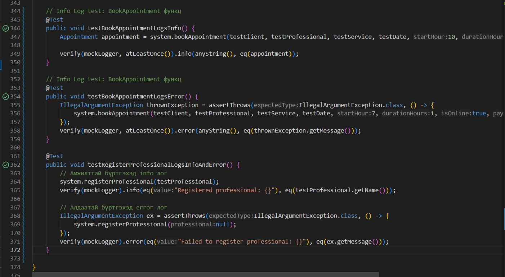

# 7-р өдөр: Мини төслийн хөгжүүлэлт - Log4j v2 ашиглан лог хийх

**Зорилго: Мини төсөлд Log4j v2 ашиглан үйлдэл болон алдааны лог хийх.**

## 1. Log4j v2-г төсөлд тохируул

Log4j 2 тохируулахын тулд pom.xml файлыг нээж, <dependencies> хэсэгт дараах dependency-г нэмнэ:

```
    <!-- Log4j 2 Core -->
    <dependency>
        <groupId>org.apache.logging.log4j</groupId>
        <artifactId>log4j-core</artifactId>
        <version>2.23.1</version> <!-- Хамгийн сүүлийн хувилбарыг ашиглана уу -->
    </dependency>
    
    <!-- Log4j 2 API -->
    <dependency>
        <groupId>org.apache.logging.log4j</groupId>
        <artifactId>log4j-api</artifactId>
        <version>2.23.1</version>
```

src/main/resources хавтас дотор log4j2.xml файл үүсгэж, тохируулна.

## 2. Гол функцүүдэд лог нэмэх

Жишээ нь AppointmentSystem классд мэргэжилтэн бүргэх функцэд лог нэмье

- нэмэж бичсэн лог нь хэрвээ функц зөв ажиллаж мэргэжилтнийг системд нэмсэн бол **Registered professional: name**
гэж (logs/appointments.log) файлд бичигдэнэ.
- Хэрвээ функц ажиллахад алдаа гарвал **Failed to register professional: e.getMessage()** гэж лог файлд бичигдэнэ.

```
    public void registerProfessional(Professional professional) {
        try {
            if (professional == null) {
                throw new IllegalArgumentException("Professional cannot be null");
            }
            schedules.put(professional, new HashMap<>());
            logger.info("Registered professional: {}", professional.getName());
        } catch (IllegalArgumentException e) {
            logger.error("Failed to register professional: {}", e.getMessage());
            throw e;
        }
    }
```

### Үүнтэй адил дараах гол функцүүдэд лог-ийг нэмэв.

**AppointmentSystem:**

- AppointmentSystem
- registerProfessional
- initializeDay
- bookAppointment
- cancelAppointment

**Appointment class:**

- Appointment

**Service class:**

- Service
- addProfessional
- removeProfessional

## 3. Лог бичигдсэнийг шалгар unit test

Дээрх бичигдсэн registerProfessional функц лог-ийг (logs/appointments.log) файлд бичиж байгаа эсэхийг доорх тестээр шалгана.

```
    @Test
    public void testRegisterProfessionalLogsInfoAndError() {
        // Амжилттай бүртгэхэд info лог
        system.registerProfessional(testProfessional);
        verify(mockLogger).info(eq("Registered professional: {}"), eq(testProfessional.getName()));

        // Алдаатай бүртгэхэд error лог
        IllegalArgumentException ex = assertThrows(IllegalArgumentException.class, () -> {
            system.registerProfessional(null);
        });
        verify(mockLogger).error(eq("Failed to register professional: {}"), eq(ex.getMessage()));
    }
```

Дээрх тест нь амжилттай info лог, алдаатай error лог logs/appointments.log файлд бүртгэгдсэн бол тестийг давна.

Тестүүдийг давсан нь:

