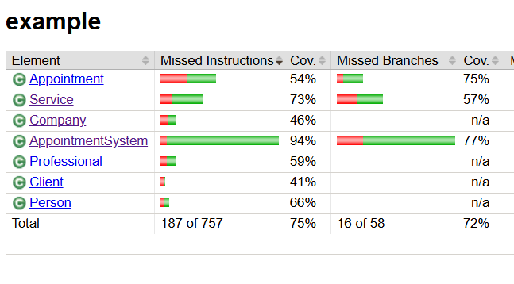
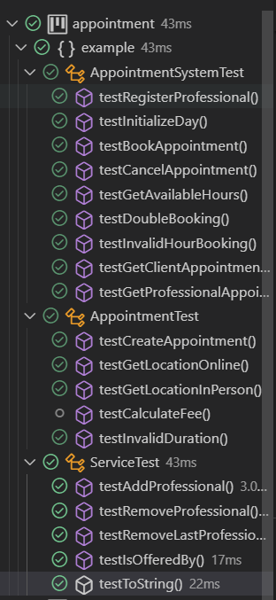

# 5-р өдөр: Мини төслийн хөгжүүлэлт - Тест бичих (TDD)

Зорилго: Мини төсөлд unit тест бичиж, Test-Driven Development (TDD) зарчмыг хэрэглэх.

## Биегүй бичигдсэн үлдсэн функцуудыг гүйцээж бичив

**AppointmentSystem class:**

1. Мэргэжилтний тодорхой өдрийн бүх боломжтой цагийг жагсаалтаар буцаана.

    Авах утга (Мэргэжилтэн, тухайн өдөр)\
    Буцаах утга - Тухайн өдрийн боломжтой цагийн жагсаалт

```
   public List<Integer> getAvailableHours(Professional professional, LocalDate date) {
        validateProfessional(professional);
        
        ...

        boolean[] hours = professionalSchedule.get(date);
        for (int i = 0; i < hours.length; i++) {
            if (!hours[i]) {
                availableHours.add(WORKING_HOUR_START + i);
            }
        }
        return availableHours;
    }
```

2. Захиалсан уулзалт, цагийг цуцлана

    Авах утга - Авсан цаг\
    Буцаах утга - void

```
    public void cancelAppointment(Appointment appointment) {
        Professional professional = appointment.getProfessional();
        validateProfessional(professional);
        
        LocalDate date = appointment.getDate();
        int startHour = appointment.getStartHour();
        int durationHours = appointment.getDurationHours();

        ...

        appointments.remove(appointment);
    }
```

3. Оруулсан цагийг ажлын цагт багтаж байгааг шалгана

    Авах утга - int цаг\
    Буцаах утга - Ажлын цагт багтах бол true, үгүй бол false

```
    private void validateHour(int hour) {
        if (hour < WORKING_HOUR_START || hour > WORKING_HOUR_END) {
            return false;
        }

        return true;
    }
```

4. Тухайн хэрэглэгчийн бүх захиалгыг буцаана

    Авах утга - хэрэглэгч\
    Буцаах утга - Хэрэглэгчийн захиалсан цагийн жагсаалт

```
    public List<Appointment> getClientAppointments(Client client) {
        List<Appointment> result = new ArrayList<>();
        for (Appointment appt : appointments) {
            if (appt.getClient().equals(client)) {
                result.add(appt);
            }
        }
        return result;
    }
```

5.  Мэргэжилтний бүх захиалгыг буцаана

    Авах утга - мэргэжилтэн\
    Буцаах утга - Мэргэжилтны захиалгатай цагийн жагсаалт

```
    public List<Appointment> getProfessionalAppointments(Professional professional) {
        validateProfessional(professional);
        
        List<Appointment> result = new ArrayList<>();
        for (Appointment appt : appointments) {
            if (appt.getProfessional().equals(professional)) {
                result.add(appt);
            }
        }
        return result;
    } 
```

## Unit Test

**Тест бүрийн тайлбар**

### AppointmentTest class

#### 1. testCreateAppointment():

- Захиалга амжилттай үүсэж байгаа эсэхийг шалгана
- Бүх аттрибутад зөв утга оноогдсон эсэхийг шалгана

#### 2. testGetLocationOnline():

- Онлайн уулзалтын байршил "Online" гэж буцаагдах эсэхийг шалгана

#### 3. testGetLocationInPerson():

- Биечлэн уулзалтын байршил компаний хаягтай ижил эсэхийг шалгана

#### 4. testCalculateFeeByDuration():

- Хугацаагаар төлбөр тооцоолох зөв ажиллаж байгаа эсэхийг шалгана

#### 5. testInvalidDuration():

- Хугацаа 0 эсвэл түүнээс бага үед алдаа өгөх эсэхийг шалгана

### AppointmentSystemTest class

#### 1. setUp() метод:

- Туршилт бүрт ашиглагдах системийн объект болон бусад тестийн өгөгдлүүдийг эхлүүлнэ
- Мэргэжилтэн, үйлчилгээ, хэрэглэгч зэрэг объектуудыг үүсгэнэ
- Системд мэргэжилтэн бүртгэж, өдрийн цагийг эхлүүлнэ

#### 2. testRegisterProfessional():

- Шинэ мэргэжилтэн бүртгэхэд амжилттай ажиллаж байгаа эсэхийг шалгана
- Бүртгэгдсэн мэргэжилтэн өдөр эхлүүлэх боломжтой эсэхийг шалгана

#### 3. testInitializeDay():

- Өдрийн цагийг эхлүүлсний дараа бүх цаг чөлөөтэй байгаа эсэхийг шалгана

#### 4. testBookAppointment():

- Захиалга амжилттай үүсгэгдэж, харгалзах цаг завгүй болж байгаа эсэхийг шалгана
- Хэрэглэгчийн захиалгын жагсаалтад шинэ захиалга нэмэгдсэн эсэхийг шалгана

#### 5. testCancelAppointment():

- Захиалга цуцлагдсаны дараа цаг чөлөөтэй болж, жагсаалтаас хасгагдаж байгаа эсэхийг шалгана

#### 6. testGetAvailableHours():

- Захиалга хийсэн цагууд жагсаалтад байхгүй, чөлөөт цагууд жагсаалтад байгаа эсэхийг шалгана

#### 7. testDoubleBooking():

- Нэг цагт хоёр дахь захиалга хийхэд алдаа өгөх эсэхийг шалгана

#### 8. testInvalidHourBooking():

- Ажиллах цагийн бус захиалга хийхэд алдаа өгөх эсэхийг шалгана

#### 9. testGetClientAppointments():

- Хэрэглэгчийн бүх захиалгуудыг зөв буцааж байгаа эсэхийг шалгана

#### 10. testGetProfessionalAppointments():

- Мэргэжилтэнд хийгдсэн бүх захиалгуудыг зөв буцааж байгаа эсэхийг шалгана

### Тест давалт





## Кодын баримтжуулалт

Функц, тестүүдэд коммент нэмэв. 

Жишээ нь 

```
/**
 * Цаг захиалгын системийг удирдах үндсэн класс
 */

public class AppointmentSystem {
    private Map<Professional, Map<LocalDate, boolean[]>> schedules;
    private List<Appointment> appointments;
    private static final int WORKING_HOUR_START = 9;
    private static final int WORKING_HOUR_END = 17;

    /**
     * Байгуулагч функц
     */
    public AppointmentSystem() {
        this.schedules = new HashMap<>();
        this.appointments = new ArrayList<>();
    }

    /**
     * Шинэ мэргэжилтэн бүртгэх
     * @param professional Бүртгэх мэргэжилтэн
     * @throws IllegalArgumentException professional null байвал
     */
    public void registerProfessional(Professional professional) {
        if (professional == null) {
            throw new IllegalArgumentException("Professional cannot be null");
        }
        schedules.put(professional, new HashMap<>());
    }
```