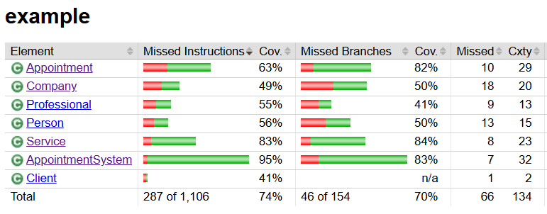

# 6-р өдөр: Мини төслийн хөгжүүлэлт - Алдаа зохицуулалт

Зорилго: Мини төсөлд алдаа зохицуулалт нэмэх.

## 1. Алдаа зохицуулалт нэмэх

1. Класс бүрийн байгуулагч функцэд оруулсан аргументуудыг шалгаж, объект үүсгэнэ. Алдаа гарвал IllegalArgumentException throw хийнэ.

**Жишээ нь Professional классын байгуулагч функц:**

- email '@' тэмдэгт агуулж байх ёстой
- name хоосон байж болохгүй 
- утасны дугаар 8 оронтой байх ёстой
- specialty хоосон байж болохгүй
- rating 0-5 хоорондох утга авна

```
    public Professional(int id, String name, String phone, String email, String specialty, double rating, double pricePerHour, Company company) {
        super(id, name, phone, email);
    
        // email '@' тэмдэгт агуулж байгааг шалгах
        if (email == null || !email.contains("@")) {
            throw new IllegalArgumentException("Email must contain '@' symbol");
        }
    
        if (name == null || name.trim().isEmpty()) {
            throw new IllegalArgumentException("Name cannot be null or empty");
        }
    
        // утасны дугаар 8 оронтой байна
        if (phone == null || phone.trim().isEmpty() || phone.length() != 8) {
            throw new IllegalArgumentException("Phone cannot be null or empty and must be 8 digits");
        }
    
        if (specialty == null || specialty.trim().isEmpty()) {
            throw new IllegalArgumentException("Specialty cannot be null or empty");
        }
    
        // rating 0-5 хооронд байх
        if (rating < 0 || rating > 5) {
            throw new IllegalArgumentException("Rating must be between 0 and 5");
        }
    
        // эерэг утга шалгах
        if (pricePerHour < 0) {
            throw new IllegalArgumentException("Price cannot be negative");
        }
    
        this.specialty = specialty;
        this.rating = rating;
        this.pricePerHour = pricePerHour;
        this.company = company;
    }
```

2. Гол функцуудэд алдаа зохицуулалт нэмнэ.

Жишээ нь AppointmentSystem класст мэргэжилтийн хуваарь байгаа үгүйг шалгах функц validateProfessional нэмэж бичиж
мөн цаг нь ажлын цагт багтаж байгааг шалгах validateHour функцууд байгаа ба алдаа гарвал IllegalArgumentException throw хийнэ

```
    private void validateProfessional(Professional professional) {
        if (!schedules.containsKey(professional)) {
            throw new IllegalArgumentException("Professional not registered in the schedule");
        }
    }

    /**
     * Цагийг баталгаажуулна
     * @param hour цаг
     * @throws IllegalArgumentException String цаг 9-17 хооронд биш байвал
     */
    private void validateHour(int hour) {
        if (hour < WORKING_HOUR_START || hour > WORKING_HOUR_END) {
            throw new IllegalArgumentException(
                String.format("Hour must be between %d and %d", WORKING_HOUR_START, WORKING_HOUR_END)
            );
        }
    }

    /**
     * Шинэ мэргэжилтэн бүртгэх
     * @throws IllegalArgumentException professional null байвал
     */
    public void registerProfessional(Professional professional) {
        if (professional == null) {
            throw new IllegalArgumentException("Professional cannot be null");
        }
        schedules.put(professional, new HashMap<>());
    }

    /**
     * Өдрийн цагийг эхлүүлэх
     * @throws IllegalArgumentException professional бүртгэлгүй байвал
     */
    public void initializeDay(Professional professional, LocalDate date) {
        validateProfessional(professional);
        
        boolean[] hours = new boolean[WORKING_HOUR_END - WORKING_HOUR_START + 1];
        schedules.get(professional).put(date, hours);
    }
```

## Алдааны тохиолдлын UT нэмэх

Жишээ нь AppointmentSystemTest class-д

-  Бүртгэлгүй мэргэжилтэн дээр цаг авах гэж оролдох үед алдаа шидэх тест

```
    @Test
    public void testBookAppointmentWithUnregisteredProfessional() {
        Professional unregistered = new Professional(
            3, "Unregistered", "99880000", "un@test.com",
            "Test", 1, 10000, testProfessional.getCompany()
        );

        testService.addProfessional(unregistered);
    
        assertThrows(IllegalArgumentException.class, () -> { system.bookAppointment( testClient,
                unregistered, testService, testDate, 14, 1, false, true, "Test"
            );
        });
    }
```

- огт байхгүй цагийг захиалгын цагуудаас хасах үед алдаа шидэх

```
    @Test
    public void testCancelNonExistentAppointment() {
        Appointment fakeAppointment = new Appointment(
            999,
            testClient,
            testProfessional,
            testService,
            testDate,
            14,
            1,
            false,
            true,
            "Fake"
        );
    
        assertThrows(IllegalArgumentException.class, () -> {
            system.cancelAppointment(fakeAppointment);
        });
    }
```

## Test pass

