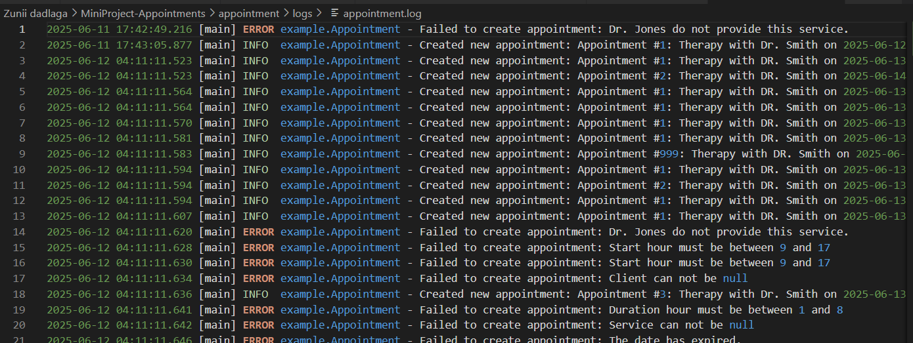

# 8, 9-р өдөр: Төслийн өнгөлгөө, тайлан ба илтгэл бэлтгэх

**Зорилго: Мини төслийг өнгөлж, тайлан, танилцуулга бэлтгэх.**

## 1. Төсөл өнгөлөх

- Кодын чанарыг сайжруулсан: коммент нэмж, нэршлийг стандартчилсан
- Бүх онцлогуудыг туршсан: Бүх онцлог функцуудыг ажиллуулж, алдааг шалгасан
- JUnit тестүүдийг дахин ажиллуулж, найдвартай байдлыг баталгаажуулсан.
- Лог файлуудыг шалгасан: appointment-system.log, appointment.log, service.log файлууд бүрэн бичигдсэн

## 2. Тайлан ба танилцуулга бэлтгэх

**Төслийн тайлан** бичсэн: (Report, presentation/FinalReport.docx)
**Төслийн танилцуулга**: (Report, presentation/Project presentation)

## Log file screenshot

**appointment-system.log**

**appointment.log**

**service.log**

